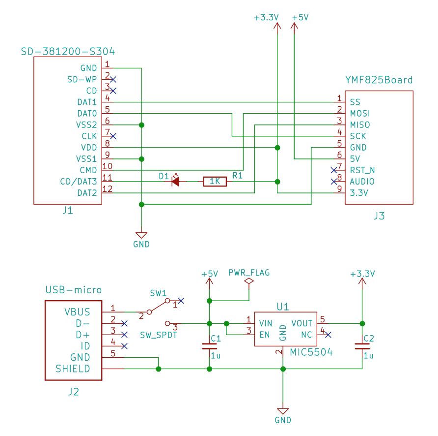

# YMF825+FlashAir Player

FlashAirを使用して、ヤマハ製FM音源YMF825を駆動するプログラムです。
LuaによるMML再生プログラムと、曲選択と簡易MMLエディタを備えたWebアプリで構成されています。

## ハードウェア

FlashAirとYMF825のSPI端子が適切に接続されていればどんなものでも構いません。
YMF825を搭載したモジュールYMF825Board(http://uda.la/fm/)を使用する場合の回路図を示します。


**YMF825Boardは3.3V設定が必要です。メーカーページを参照して必ず設定してください。**

## FlashAirのバージョンと設定

FlashAirはW-04のFW4.00.00のものを使用する必要があります。現状、それ以降のバージョンでは対応できませんので注意してください。

また、LuaからのI/Oアクセスと、WebDAVおよびWebDAVからのファイル更新を許可する必要があります。/SD_WLAN/CONFIG に適切な設定を行ってください。
``` :/SD_WLAN/CONFIG
IFMODE=1
WEBDAV=2
UPLOAD=1
```

## 実行するには

以下のファイルを展開してFlashAirのルーディレクトリに置いてください。
[Download](https://github.com/shuichitakano/ymf825playFA/releases/download/v0.1/air825_180708.zip)

FlashAirにWiFi接続してindex.htmlを開くとWebアプリが実行されます。

## MML仕様

基本的にはX68000のMDXのMML仕様に準拠します。
ただし文字コードにはUTF8を用いてください。
もちろんADPCMのサポートはありませんので、関連機能は使用できません。

また、YMF825は16chのFM音源ですので、ABCDEFGHの8chに加えて、IJKLMNOPの8chが使用できます。

## 音色定義

音色定義もMDX準拠でYM2151ベースのパラメータを用います。YM825とYM2151はアルゴリズムもパラメータカーブも違いますが、合わせられるところはなんとなく変換を行っています。
うまくいかないことも多いですのであまり期待しないでください。

YMF825ネイティブの定義方法もあってしかるべきですが、ありません。
今後追加予定です。

## 注意

FlashAirは酷使するとすぐ機嫌を損ねて不思議な動作をすることがあります。温かい目で見守りつつ優しくリセットしてください。


